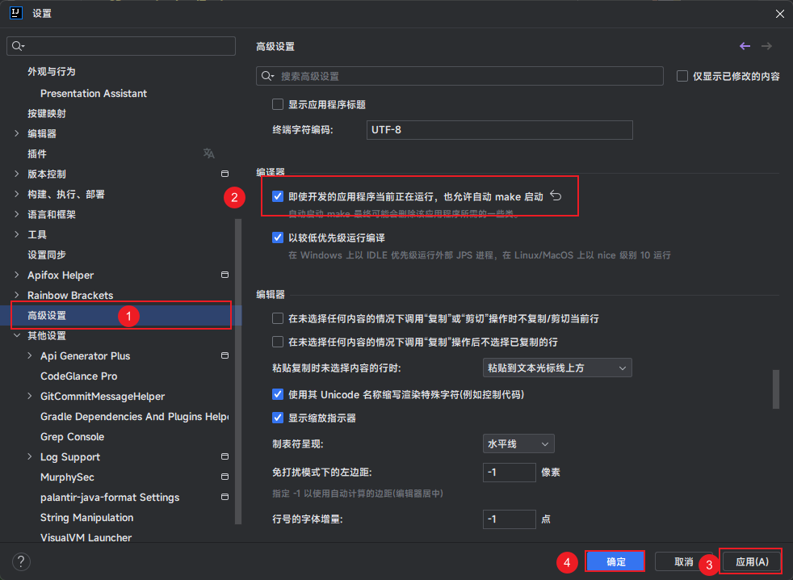
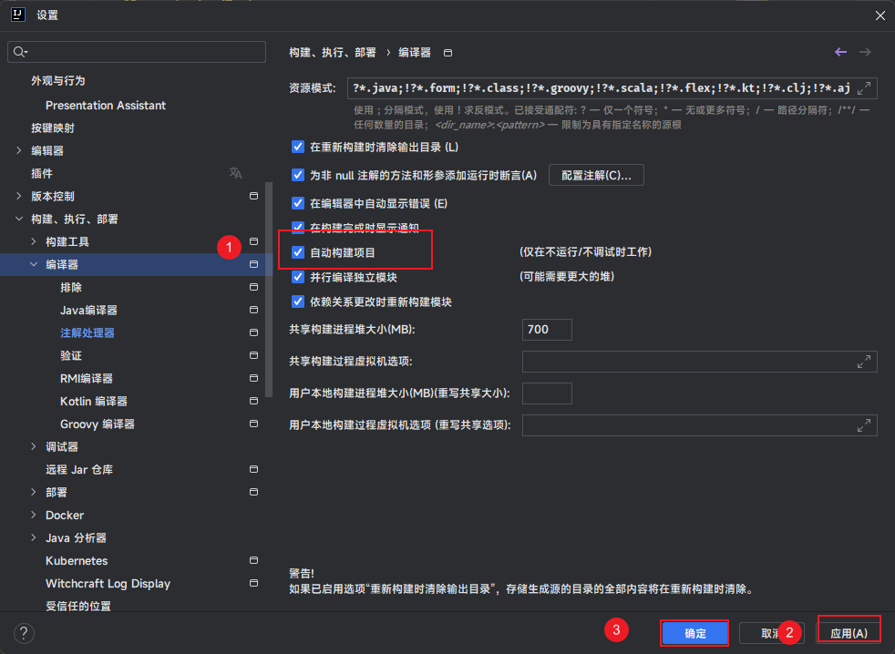
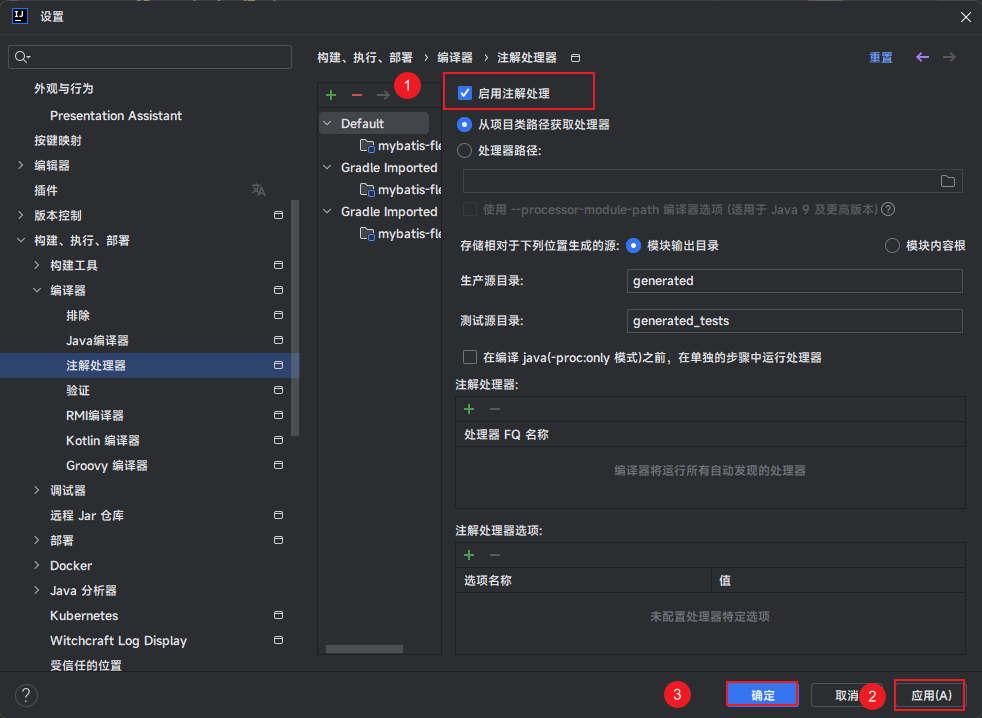

# MybatisFlex 的演示代码

## 前提说明

* 需要本地有 Docker 环境，[Win11 安装 Docker](https://www.yuque.com/fairy-era/yg511q/pkv229) 。

## 软件依赖版本

* JDK 17。
* IDEA 最新即可。
* Docker 最新即可。

## IDEA 开启功能

* IDEA 需要开启的功能如下：

